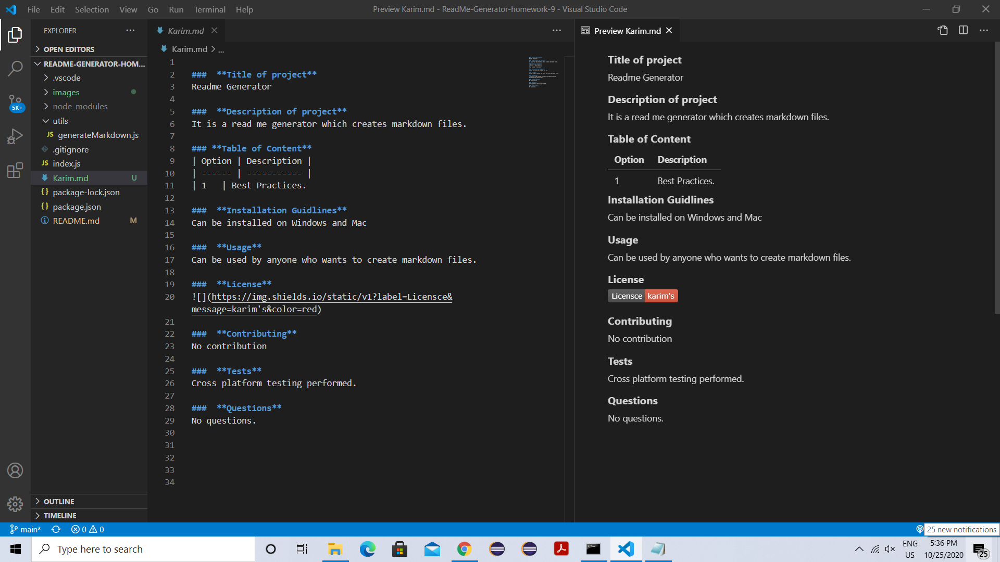

# ReadMe-Generator-homework-9
This is a command-line application that accepts user input. User is  prompted for information about my application repository
then a quality, professional README.md is generated with the title of your project and sections entitled Description, Table of Contents, Installation, Usage, License, Contributing, Tests, and Questions.
When user enters project title then it will be displayed as the title of the README file.When user enters description, installation instructions, usage information, contribution guidelines, and test instructions then that information is added to the sections of the README entitled Description, Installation, Usage, Contributing, and Tests. When user enters a license for application then a badge for that license is added.

# Images

# Links
Git hub: https://github.com/karimkapadia/ReadMe-Generator-homework-9
Google Drive Link to Video: https://drive.google.com/file/d/1RVFzxxxO0oat57GxxJfh_Hn3C29r5K9N/view?usp=sharing

